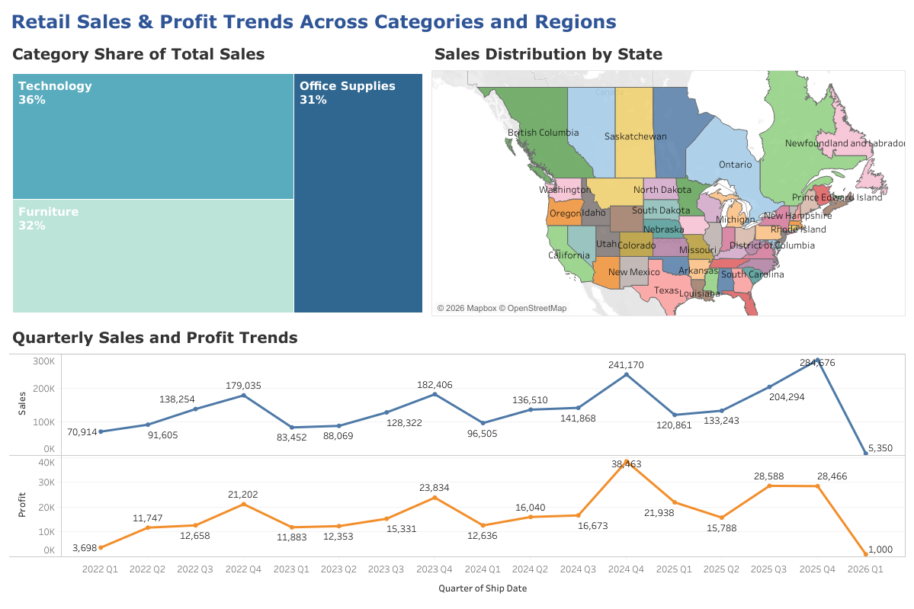
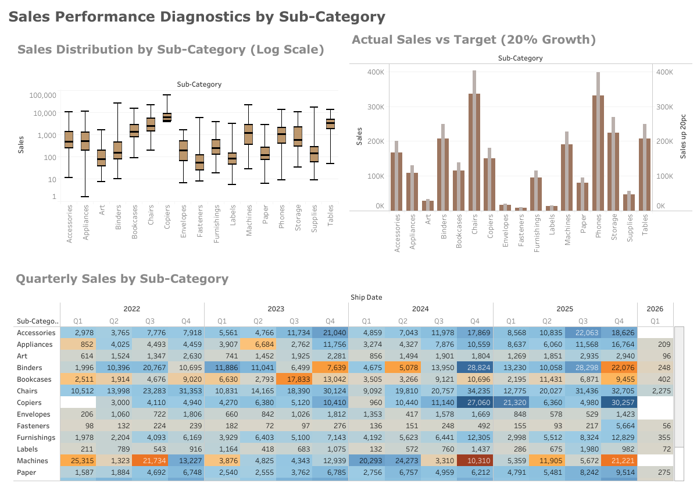

# 📊 Retail Performance Analysis — Sales & Profit

Interactive Tableau dashboard analyzing retail sales performance across product categories, geography, and time.

🔗 **Live Interactive Dashboard:**  
https://public.tableau.com/app/profile/muhammad.shahryar

---

## 📌 Overview

This project evaluates retail performance through:

- Revenue concentration across product categories  
- Geographic sales distribution  
- Quarterly sales and profitability trends  

The objective is to mirror how analysts assess commercial performance, volatility, and growth dynamics in real-world business environments.

---

## 🖥 Dashboard Preview

### 1️⃣ Retail Sales & Profit Overview

Integrated view of category mix and geographic sales distribution.  
Highlights revenue concentration and regional performance differences.

---

### 2️⃣ Quarterly Sales & Profit Performance Trends

Time-series analysis of revenue and profitability.  
Identifies growth cycles, volatility, and seasonal patterns.

---

## 🛠 Tools

- Tableau Public  
- Interactive dashboard design  
- Time-series visualization  
- KPI benchmarking  

---

## 🎯 Project Purpose

This project demonstrates:

- Business-oriented data storytelling  
- Structured commercial performance analysis  
- Clear visual communication of KPIs  
- Translation of raw sales data into decision-relevant insights  

---

**Muhammad Shahryar**  
Data Science & Economics  
Tableau • SQL • Python • R • Excel
